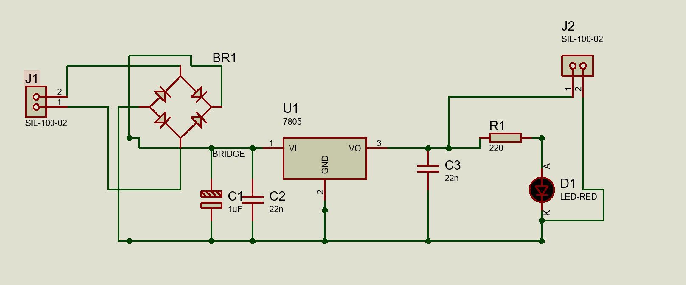
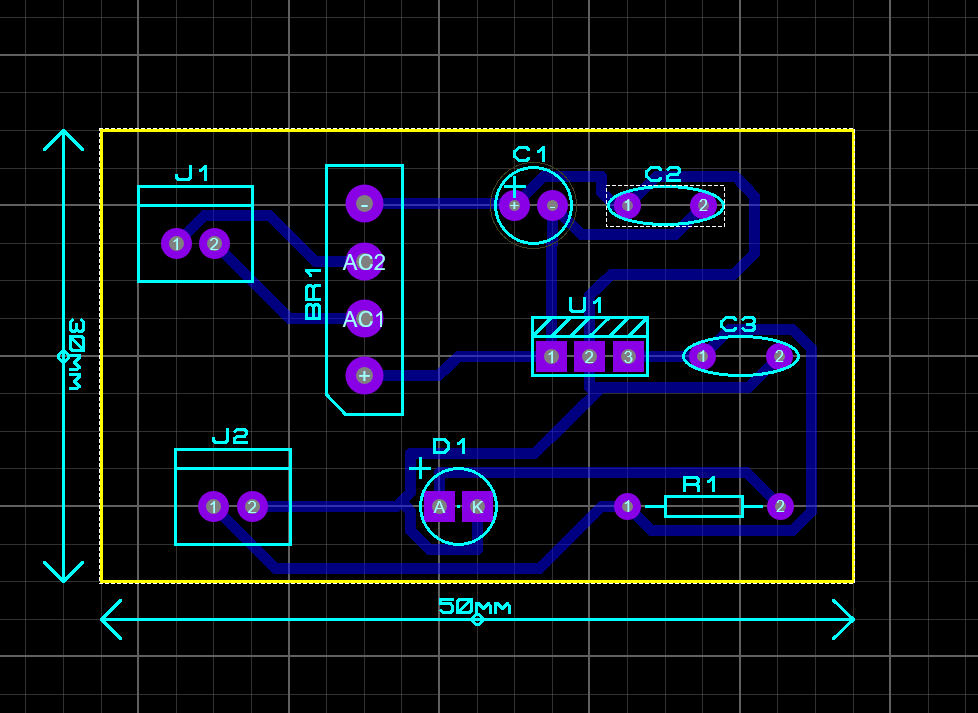
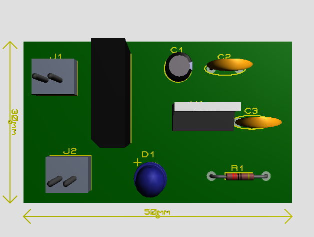
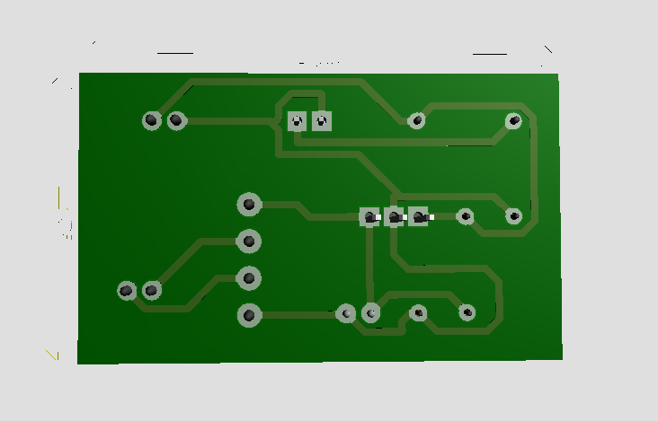

 Projeto de Fonte 5V com 7805

Este projeto consiste em uma fonte de alimentação linear simples utilizando um transformador, ponte retificadora, regulador de tensão 7805, capacitores de filtragem/desacoplamento e um LED indicador. A saída nominal é de 5V DC, adequada para alimentar pequenos projetos eletrônicos.

Índice de Seções :

1.Objetivo do Projeto

2.Componentes Utilizados

3.Esquemático

4.PCB

5.Visualização 3D

6.Prática (Montagem Breadboard)

1.Objetivo do Projeto

O objetivo é demonstrar a montagem de uma fonte linear que:

Reduz a tensão da rede elétrica por meio de um transformador (por exemplo, 110/220VAC para 9VAC ou 12VAC).

Retifica a saída do transformador com uma ponte retificadora (BR1).

Filtra a tensão DC resultante com capacitores (C1, C2, C3).

Regula a tensão para 5V estáveis com o regulador de tensão linear 7805 (U1).

Indica a presença de tensão de saída com um LED (D1) em série com um resistor de 220 Ω (R1).

2.Componentes Utilizados

Transformador: 110/220VAC para 9V ou 12V (saída AC)

Ponte Retificadora: BR1

Regulador de Tensão: 7805 (U1)

Capacitores:

C1 = 1 µF (filtro principal ou desacoplamento)

C2 = 22 nF (filtro de alta frequência no pino de entrada do 7805)

C3 = 22 nF (filtro de alta frequência no pino de saída do 7805)

LED Vermelho (D1) + Resistor 220 Ω (R1) para indicação de alimentação

Conectores: J1 (entrada AC do transformador) e J2 (saída 5V)

3.Esquemático

Esta imagem representa todo o diagrama elétrico do circuito.

J1 recebe a tensão AC do transformador.

A ponte retificadora converte AC em DC pulsante.

O capacitor C1 faz o primeiro estágio de filtragem.

C2 e C3 atuam como filtros e desacoplamentos próximos ao regulador 7805.

A saída do regulador (5V) alimenta o LED indicador através de um resistor.

J2 disponibiliza a saída de 5V regulados.

4.PCB

Esta imagem mostra o layout desenhado em software Protheus 8 e as trilhas de conexão no lado cobreado da placa.

As dimensões finais estimadas são cerca de 50 mm x 30 mm.

Os furos dos conectores J1 e J2 facilitam a ligação de entradas e saídas.

O regulador 7805 (U1) está centralizado, com trilhas de entrada e saída bem definidas.

5.Visualização 3D

Nesta seção é exibida a visão tridimensional da placa, facilitando a identificação e o posicionamento dos componentes:

Ponte retificadora (BR1) próxima ao conector de entrada (J1).

Capacitores (C1, C2 e C3) nas posições adequadas para filtragem.

Diodo LED (D1) e resistor (R1) na parte frontal da placa.

Conector de saída (J2) para os 5V.

6.Prática (Montagem)

Estas fotos mostram a montagem do circuito em uma protoboard para teste:

Pode-se observar o transformador alimentando a protoboard.

A ponte retificadora, capacitores e o 7805 estão conectados de acordo com o esquemático.

O LED aceso indica que a saída de 5V está funcionando.

Na medição de tensão de saída (mostrada no multímetro), foi verificado aproximadamente 4,96–5,01 V, validando o funcionamento do regulador.

Autor: [Gabriel Pierin Caurio]
Data: [Março/2025]